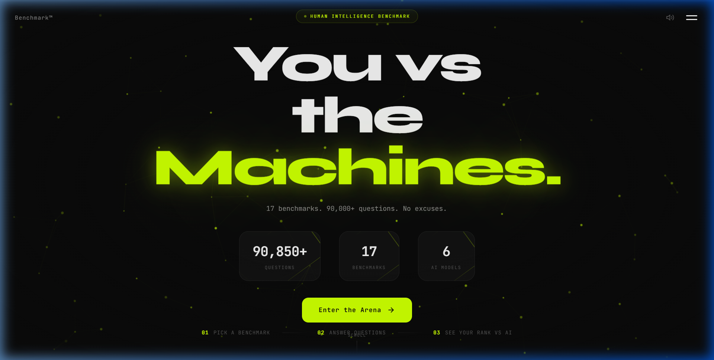
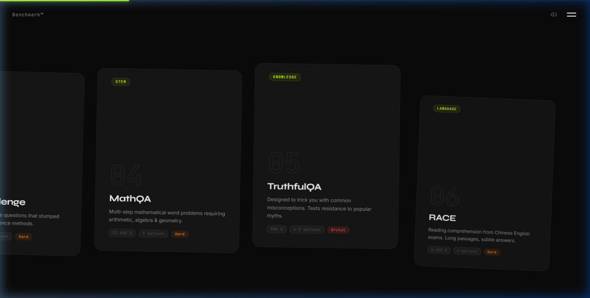
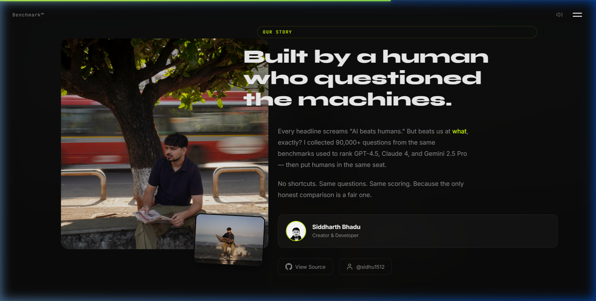

# Benchmark — Human vs AI

<div align="center">



**Can you outsmart GPT-4.5, Claude 4, and Gemini 2.5 Pro?**

[**Launch Live Demo**](https://sidhu1512.github.io/howSMARTERyouARE/) · [**View Source**](https://github.com/sidhu1512/howSMARTERyouARE)

</div>

---

## What Is This?

A web-based intelligence benchmark that puts **you** in the same seat as frontier AI models. Take the exact same tests used to evaluate GPT-4.5, Claude 4 Opus, Gemini 2.5 Pro, DeepSeek R1, Llama 4 Maverick, and Grok 3 — then see how you compare.

- **90,850+ questions** across **17 official benchmarks**
- **50 random questions** per session, scored instantly
- **Side-by-side comparison** with 6 frontier AI models
- **100% client-side** — no backend, no API calls, works offline

---

## Screenshots

<div align="center">

| Benchmark Cards | Our Story |
|:---:|:---:|
|  |  |

</div>

---

## Benchmarks Included

17 official datasets across 5 domains:

### Logic & Reasoning
| # | Benchmark | Questions | Difficulty |
|---|-----------|-----------|------------|
| 02 | **HellaSwag** — Commonsense sentence completion | 13,000 | Medium |
| 08 | **Winogrande** — Pronoun resolution | 3,250 | Medium |
| 11 | **PIQA** — Physical intuition | 1,800 | Medium |
| 13 | **BoolQ** — Yes/No with tricky passages | 1,000 | Easy |
| 14 | **COPA** — Cause & effect reasoning | 400 | Easy |
| 17 | **SWAG** — Video caption prediction | 2,000 | Medium |

### General Knowledge
| # | Benchmark | Questions | Difficulty |
|---|-----------|-----------|------------|
| 01 | **MMLU** — 57 subjects from STEM to humanities | 14,350 | Hard |
| 05 | **TruthfulQA** — Resistance to popular myths | 850 | Brutal |
| 09 | **CommonsenseQA** — Everyday world knowledge | 3,200 | Medium |

### STEM
| # | Benchmark | Questions | Difficulty |
|---|-----------|-----------|------------|
| 03 | **ARC Challenge** — Grade-school science | 2,300 | Hard |
| 04 | **MathQA** — Multi-step math word problems | 32,800 | Hard |
| 07 | **AQUA-RAT** — Algebraic word problems (GRE/GMAT) | 1,250 | Brutal |
| 10 | **SciQ** — Physics, chemistry & biology | 4,000 | Easy |
| 12 | **OpenBookQA** — Science facts + multi-hop reasoning | 500 | Hard |
| 16 | **QASC** — Multi-hop science reasoning | 1,700 | Hard |

### Medicine
| # | Benchmark | Questions | Difficulty |
|---|-----------|-----------|------------|
| 15 | **MedMCQA** — Real medical entrance exams | 3,000 | Brutal |

### Language
| # | Benchmark | Questions | Difficulty |
|---|-----------|-----------|------------|
| 06 | **RACE** — Reading comprehension | 5,450 | Hard |

---

## Tech Stack

| Layer | Technology |
|-------|-----------|
| **Frontend** | Vanilla HTML, CSS, JavaScript |
| **Animations** | GSAP 3 + ScrollTrigger (horizontal scroll, parallax, card entrances) |
| **Charts** | ApexCharts (score comparison bar charts) |
| **Typography** | Syne, Inter, JetBrains Mono (Google Fonts) |
| **Data** | Pre-processed JSON shards — zero API calls |
| **Hosting** | GitHub Pages (static, no backend) |

---

## Premium UI Features

- **Magnetic Cursor** — Custom dot + ring cursor that morphs on hover
- **Film Grain Overlay** — Cinematic SVG noise texture across the dark theme
- **3D Tilt Cards** — Benchmark cards tilt in 3D with specular light highlight
- **Scroll Progress Bar** — Neon-green bar showing horizontal scroll position
- **Text Scramble** — Section titles decode from cipher characters on scroll
- **Spotlight Reveal** — Radial light follows cursor across content panels
- **Sound Design** — Synthesized click/tick sounds on interactions (toggleable)
- **Canvas Particle Network** — Interactive neural network on hero section
- **Horizontal Scroll** — Entire site scrolls horizontally with parallax layers

---

## Technical Architecture

```
howSMARTERyouARE/
├── index.html          # Single-page app
├── style.css           # Design system + all effects
├── script.js           # Quiz engine + GSAP + SOTA effects
├── data/
│   ├── manifest.json   # Chunk count per benchmark
│   ├── models.json     # AI model scores for comparison
│   ├── mmlu/           # 17 benchmark folders
│   │   ├── 0.json      #   each containing JSON shards
│   │   ├── 1.json      #   of 50 questions each
│   │   └── ...
│   └── img/            # Screenshots & images
└── scripts/
    ├── scrape.py        # Data collection from research datasets
    ├── refactor.py      # Cleaning & normalization
    ├── chunk.py         # Shard into 50-question JSON files
    └── run_all.py       # Full pipeline
```

**How it works:**
1. Python scripts collect questions from official, open-source research datasets
2. Data is cleaned, deduplicated, and split into small JSON shards (50 questions each)
3. A `manifest.json` maps benchmark names to shard counts
4. The frontend picks a random shard on-demand — instant loading, no API calls
5. Your score is compared against published AI model benchmark results from `models.json`

---

## Run Locally

```bash
git clone https://github.com/sidhu1512/howSMARTERyouARE.git
cd howSMARTERyouARE
python -m http.server 8080
# Open http://localhost:8080
```

No dependencies. No build step. No node_modules.

---

## AI Models Compared

| Model | Source |
|-------|--------|
| GPT-4.5 | OpenAI |
| Claude 4 Opus | Anthropic |
| Gemini 2.5 Pro | Google DeepMind |
| DeepSeek R1 | DeepSeek |
| Llama 4 Maverick | Meta |
| Grok 3 | xAI |

All AI scores are from published benchmark results and standardized evaluations.

---

## Credits

**Built by [Siddharth Bhadu](https://github.com/sidhu1512)**

Data sourced from official, open-source research datasets.
Comparison data sourced from model technical reports (OpenAI, Anthropic, Google, Meta, DeepSeek, xAI).

---

<div align="center">

*The only honest comparison is a fair one.*

</div>
